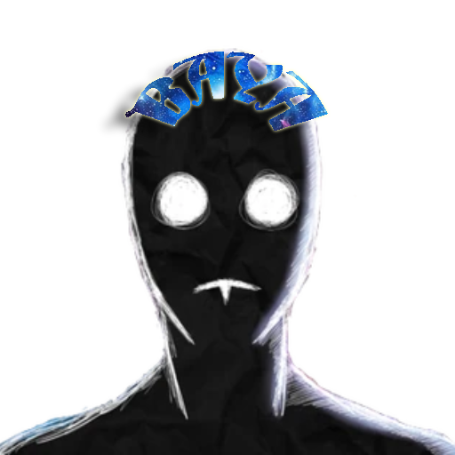

<p align="center">
  <picture>
    <source media="(prefers-color-scheme: dark)" srcset="./README/BayaLogo_White.png">
    <source media="(prefers-color-scheme: light)" srcset="./README/BayaLogo_Black.png">
    
  </picture>
</p>
<h2 align="center">
  A Roblox UI Library
  <br/>
   Catered for ME!
</h2>

```luau
local library = loadstring(game:HttpGet("https://raw.githubusercontent.com/fisiaque/BayaUILibrary/main/src.lua", true))();
```